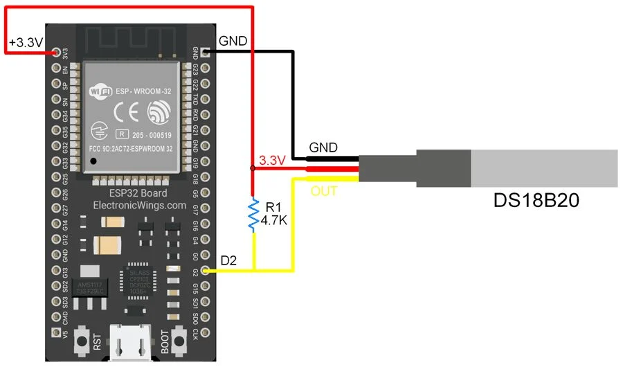
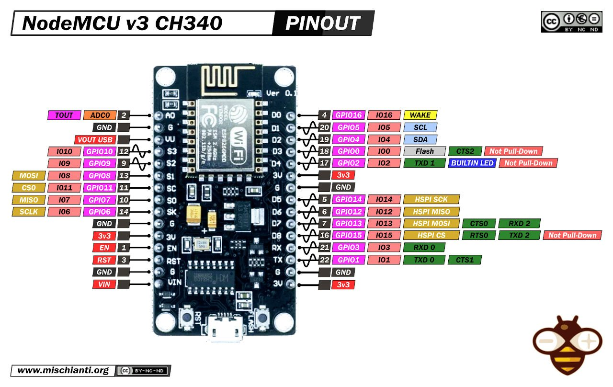

# ESP8266 Client

## Overview

This is a simple ESP8266 client that receives temperature measurements from a DS18B20 temperature sensor and sends it
over ESP-NOW to ESP8266 controller. You can find the controller code in
[here](https://github.com/ingui-n/thermometer-controller).

## Components

- ESP8266 New NodeMCU v3
- DS18B20 Temperature Sensor
- 4.7k Ohm resistor

## Wiring

Connect the DS18B20 to the ESP8266 as follows:

_Image
from: [https://www.electronicwings.com/esp32/ds18b20-sensor-interfacing-with-esp32](https://www.electronicwings.com/esp32/ds18b20-sensor-interfacing-with-esp32)_

Connect the data (yellow) wire to GPIO pin you want to use based on your ESP8266 board. Here is New NodeMCU v3 pinout:

_Image
from: [https://mischianti.org/nodemcu-v3-high-resolution-pinout-and-specs/](https://mischianti.org/nodemcu-v3-high-resolution-pinout-and-specs/)_

## Code setup

1. Clone this repository
2. Copy `include/env.h.template` to `include/env.h`
3. Fill in the values in `include/env.h` based on comments in the file
4. Use PlatformIO to compile and upload the code
